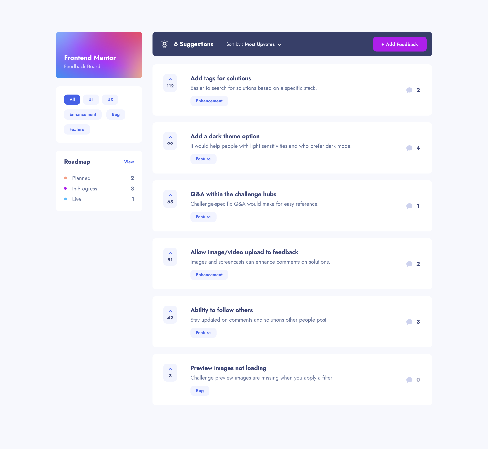

# Frontend Mentor - Multi-step form solution

This is a solution to the [Product feedback app challenge on Frontend Mentor](https://www.frontendmentor.io/challenges/product-feedback-app-wbvUYqjR6). Frontend Mentor challenges help you improve your coding skills by building realistic projects.

## Table of contents

-    [Overview](#overview)
     -    [The challenge](#the-challenge)
     -    [Screenshot](#screenshot)
     -    [Links](#links)
-    [My process](#my-process)
     -    [Built with](#built-with)
     -    [Continued development](#continued-development)
-    [Author](#author)

## Overview

### The challenge

Users should be able to:

-    View the optimal layout for the app depending on their device's screen size
-    See hover states for all interactive elements on the page
-    Create, read, update, and delete product feedback requests
-    Receive form validations when trying to create/edit feedback requests
-    Sort suggestions by most/least upvotes and most/least comments
-    Filter suggestions by category
-    Add comments and replies to a product feedback request
-    Upvote product feedback requests
-    **Bonus**: Keep track of any changes, even after refreshing the browser (`localStorage` could be used for this if you're not building out a full-stack app)

### Screenshot

### Links

-    Solution URL: [Solution](https://github.com/esdra00/Explorer-Product-Feedback-React-Ts)
-    Live Site URL: [Live Site](https://esdra00.github.io/Explorer-Product-Feedback-React-Ts/)

### Built with

-    Semantic HTML5 markup
-    CSS custom properties
-    Mobile-first workflow
-    [React](https://reactjs.org/) - JS library
-    [Typescript](https://www.typescriptlang.org)
-    [Sass](https://sass-lang.com) - Css Preprocessor
-    [Formik](https://formik.org) - Form library for React and React Native
-    [Yup](https://github.com/jquense/yup) - Schema builder for runtime value parsing and validation
-    [Firebase](https://firebase.google.com) - App development platform 

### Continued development

Add a roadmap page section

## Author

-    Website - [Add your name here](https://www.your-site.com)
-    Frontend Mentor - [@esdra00](https://www.frontendmentor.io/profile/esdra00)
-    Github - [@esdra00](https://github.com/esdra00)

